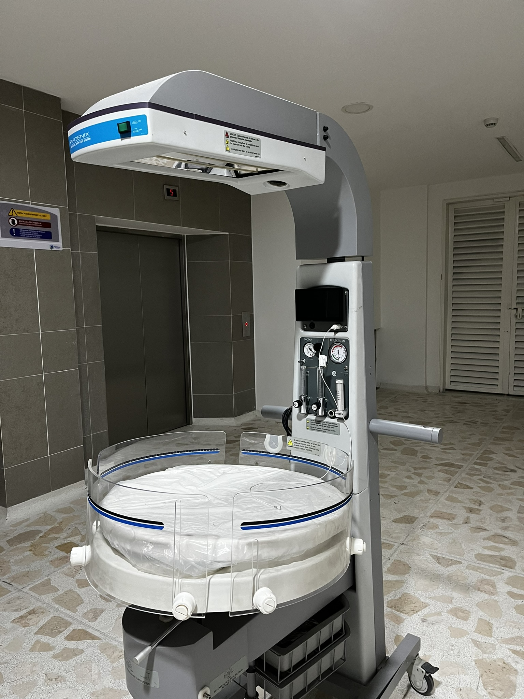

# Radiant Infant Warmer (Based in Phoenix NOC-100) 

This repository gives de detailed code for the two ESP32 Embedded systems that controls the HMI and Closed loop control system:

1. **ClosedLoop.ino**: Implements a closed-loop control system with Blynk integration for monitoring and control.
2. **HMI.ino**: Provides a human-machine interface (HMI) for user interaction and display management.

---

## Overview

  

*Figure: Example diagram of the ESP32 system setup.*

### 1. ClosedLoop.ino

This file is responsible for the core closed-loop control functionality. It integrates with the Blynk IoT platform for remote control and monitoring.

#### Features:
- **Blynk Integration**: Control setpoints and monitor system parameters remotely.
- **Curve Corrections**: Implements curve adjustments for fine-tuning control.
- **ESP-NOW Communication**: Facilitates wireless communication between devices.
- **Sampling Time Control**: Utilizes precise timing for system updates.

#### Setup:
- Replace `TEMPLATE_ID`, `TEMPLATE_NAME`, and `AUTH_TOKEN` with your Blynk credentials.
- Update Wi-Fi credentials (`ssid` and `password`) to match your network.

---

### 2. HMI.ino

This file handles the user interface on a local display connected to the ESP32. It uses the LVGL library for graphical interface rendering.

#### Features:
- **Graphical UI**: Leverages LVGL and Squareline Studio for advanced UI design.
- **ESP-NOW Communication**: Synchronizes data with other ESP32 modules.
- **Real-Time Display**: Updates system status and user inputs dynamically.

#### Setup:
- Ensure the required LVGL UI files (e.g., `ui.h`) are included in your project.
- Connect a compatible TFT display to the ESP32, configuring the backlight pin as needed (`TFT_BL`).

---

## Getting Started

1. **Prerequisites**:
   - Arduino IDE or PlatformIO for code editing and uploading.
   - ESP32 development board.
   - Required libraries:
     - `WiFi`
     - `esp_now`
     - `BlynkSimpleEsp32`
     - `lvgl`
     - `Arduino_GFX_Library`

2. **Hardware Setup**:
   - Connect the ESP32 to your Wi-Fi network.
   - Attach a TFT display to the ESP32 for the HMI.

3. **Code Upload**:
   - Open `ClosedLoop.ino` or `HMI.ino` in your preferred IDE.
   - Modify the code as per your setup.
   - Upload the code to the ESP32 board.

4. **Testing**:
   - Use the Blynk app to interact with the closed-loop control system.
   - Observe the HMI display for real-time system feedback.

---

## Dependencies

- **ClosedLoop.ino**:
  - Blynk IoT platform: [Blynk Documentation](https://docs.blynk.io)
  - ESP-NOW: [ESP-NOW Documentation](https://www.espressif.com)

- **HMI.ino**:
  - LVGL: [LVGL Documentation](https://lvgl.io)
  - Arduino GFX Library: [Arduino_GFX Documentation](https://github.com/moononournation/Arduino_GFX)

---

## License

This project is open-source and available under the [MIT License](LICENSE).
